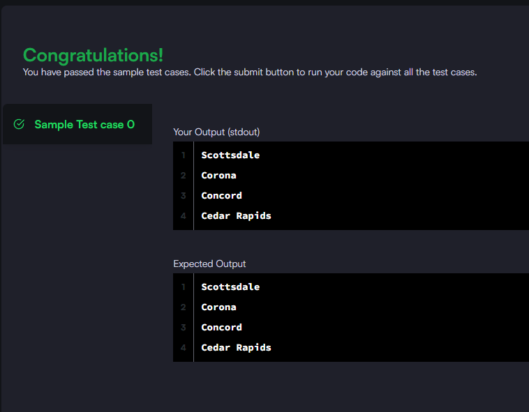

### Query the NAME field for all American cities in the CITY table with populations larger than 120000. The CountryCode for America is USA.

#### The CITY table is described as follows:

_Query utilizada:_ **SELECT name FROM city WHERE population > 120000 AND countrycode = 'USA';**

