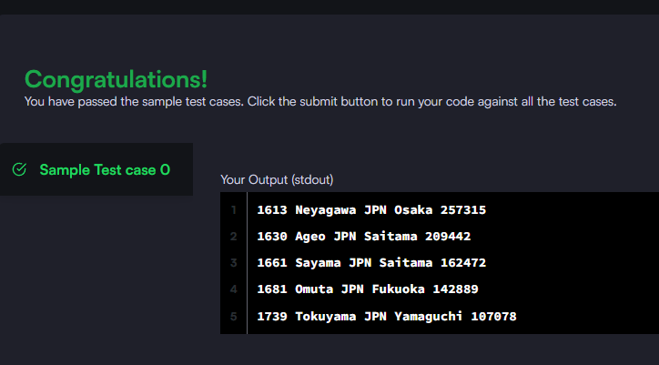

### Query all attributes of every Japanese city in the CITY table. The COUNTRYCODE for Japan is JPN.

#### The CITY table is described as follows:

_Query utilizada:_ **select \* from city where countrycode = 'JPN';**

