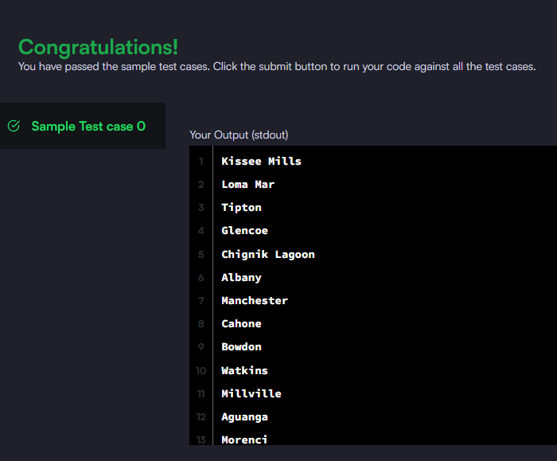

### Query a list of CITY names from STATION for cities that have an even ID number. Print the results in any order, but exclude duplicates from the answer.

#### The STATION table is described as follows:

_Query utilizada:_ **select distinct city from station where (id % 2 = 0);**

