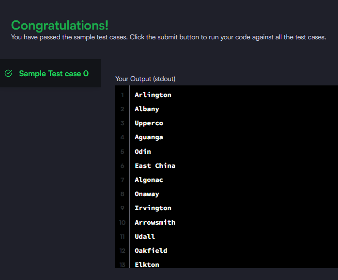

### Query the list of CITY names starting with vowels (i.e., a, e, i, o, or u) from STATION. Your result cannot contain duplicates.

#### The STATION table is described as follows:


_Query utilizada:_

```sql

SELECT DISTINCT city FROM station
WHERE left(city, 1) IN ('a','e','i','o','u');
```


