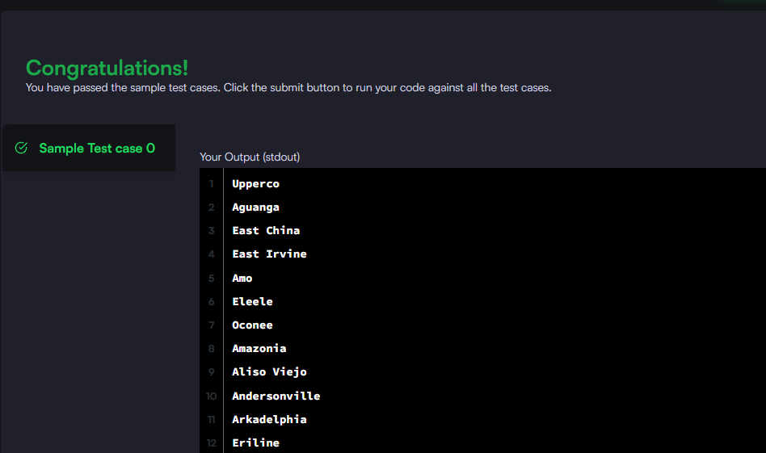

### Query the list of CITY names from STATION which have vowels (i.e., a, e, i, o, and u) as both their first and last characters. Your result cannot contain duplicates.

#### The STATION table is described as follows:


_Query utilizada:_

```sql

SELECT DISTINCT city FROM station
WHERE LEFT(city, 1) IN ('A', 'E', 'I', 'O', 'U')
AND RIGHT(city, 1) IN ('A', 'E', 'I', 'O', 'U')
GROUP BY CITY
```


