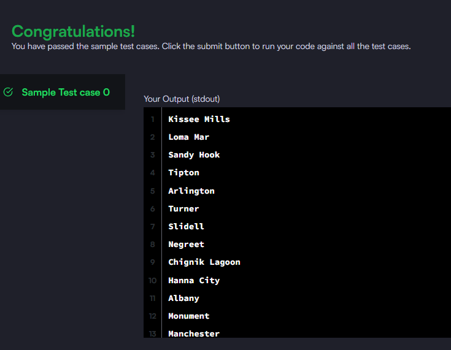

### Query the list of CITY names from STATION that do not end with vowels. Your result cannot contain duplicates.

#### The STATION table is described as follows:


_Query utilizada:_

```sql

SELECT DISTINCT city FROM station
WHERE RIGHT(city, 1)
NOT IN ('a','e','i','o','u')
```


