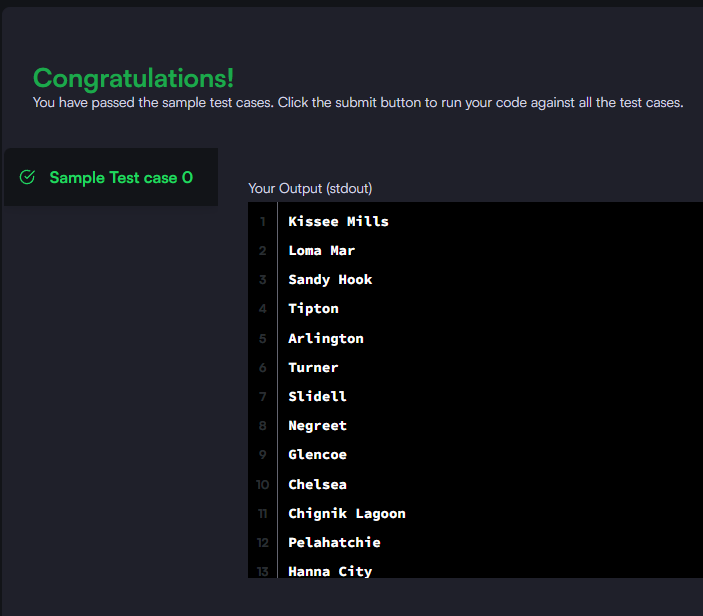

### Query the list of CITY names from STATION that either do not start with vowels or do not end with vowels. Your result cannot contain duplicates.

#### The STATION table is described as follows:


_Query utilizada:_

```sql

SELECT DISTINCT city FROM station
WHERE
LEFT(city, 1) NOT IN ('A','E','I','O','U')
OR
RIGHT(city, 1) NOT IN ('A','E','I','O','U')
```


