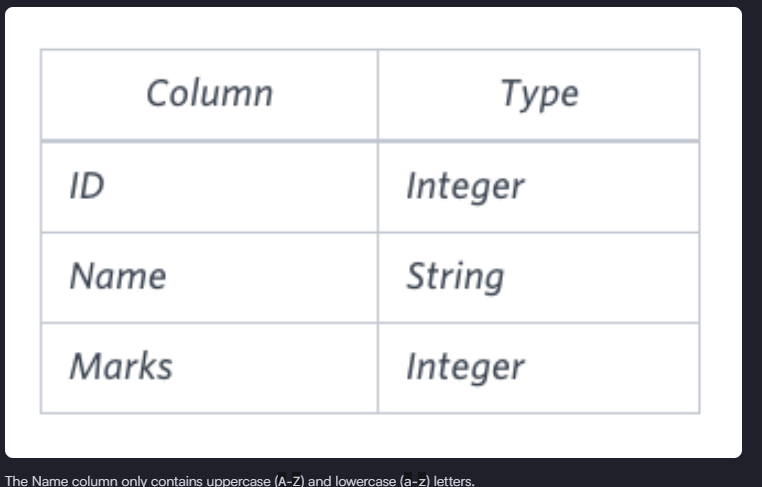
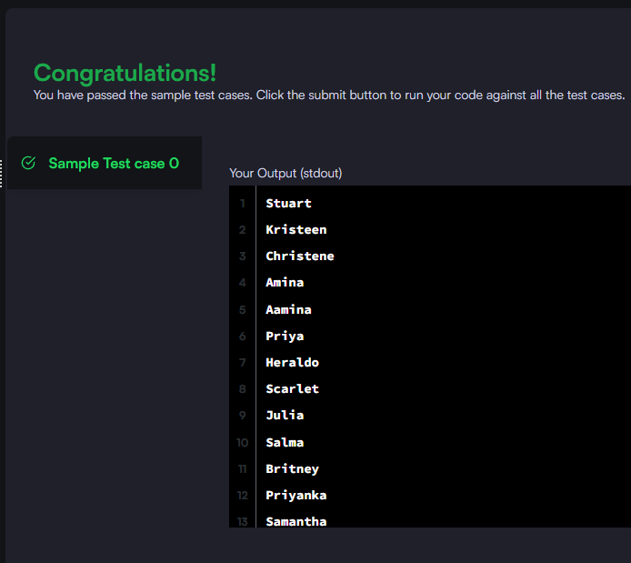

### Query the Name of any student in STUDENTS who scored higher than Marks. Order your output by the last three characters of each name. If two or more students both have names ending in the same last three characters (i.e.: Bobby, Robby, etc.), secondary sort them by ascending ID.

#### The STUDENTS table is described as follows:



_Query utilizada:_

```sql
SELECT name FROM students
WHERE marks > 75
ORDER BY
RIGHT(name,3), id ASC
```


