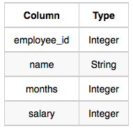
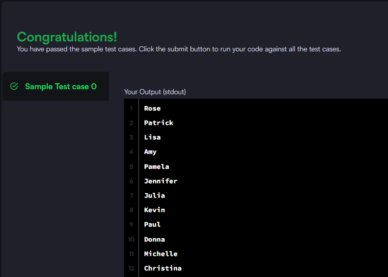

### Write a query that prints a list of employee names (i.e.: the name attribute) for employees in Employee having a salary greater than $2000 per month who have been employees for less than 10 months. Sort your result by ascending employee_id.

#### The Employee table containing employee data for a company is described as follows:



_Query utilizada:_

```sql

SELECT name FROM employee
WHERE salary > 2000 AND months < 10

```


