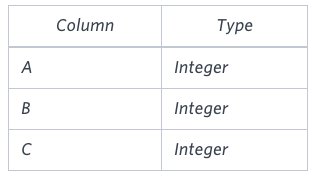
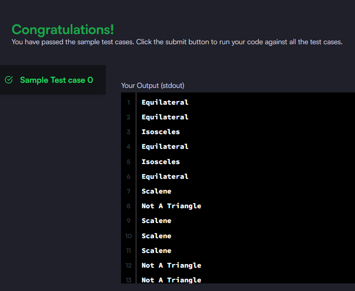

### Write a query identifying the type of each record in the **TRIANGLES** table using its three side lengths. Output one of the following statements for each record in the table:

- **Equilateral**: It's a triangle with 3 sides of equal length.
- **Isosceles**: It's a triangle with 2 sides of equal length.
- **Scalene**: It's a triangle with 3 sides of differing lengths.
- **Not A Triangle**: The given values of A, B, and C don't form a triangle.

#### The **TRIANGLES** table is described as follows::



_Query utilizada:_

```sql

SELECT
CASE
    WHEN A = B AND A = C THEN 'Equilateral'
    WHEN A + B <= C OR A + C <= B OR C + B <= A THEN 'Not A Triangle'
    WHEN A != B AND A != C THEN 'Scalene'
    ELSE 'Isosceles'
END as type
FROM triangles

```


