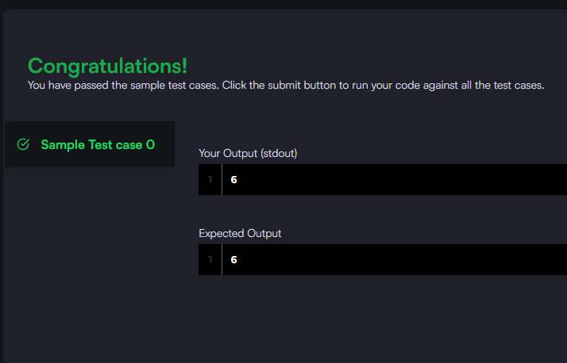

### Query a count of the number of cities in CITY having a Population larger than 100000.

#### The **CITY** table is described as follows:


_Query utilizada:_

```sql

SELECT COUNT(id) FROM city WHERE population >=100000

```


