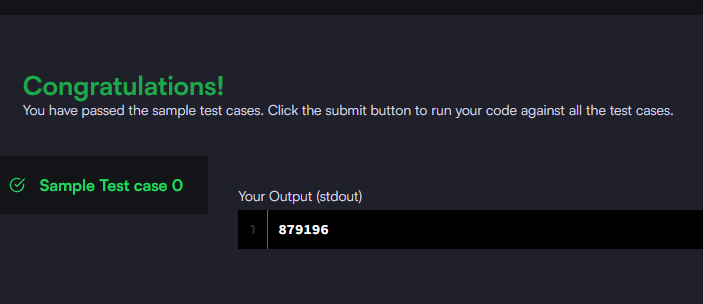

### Query the sum of the populations for all Japanese cities in **CITY**. The **COUNTRYCODE** for Japan is **JPN**.

#### The **CITY** table is described as follows:


_Query utilizada:_

```sql

SELECT SUM(population) FROM city WHERE countrycode ='jpn'

```


